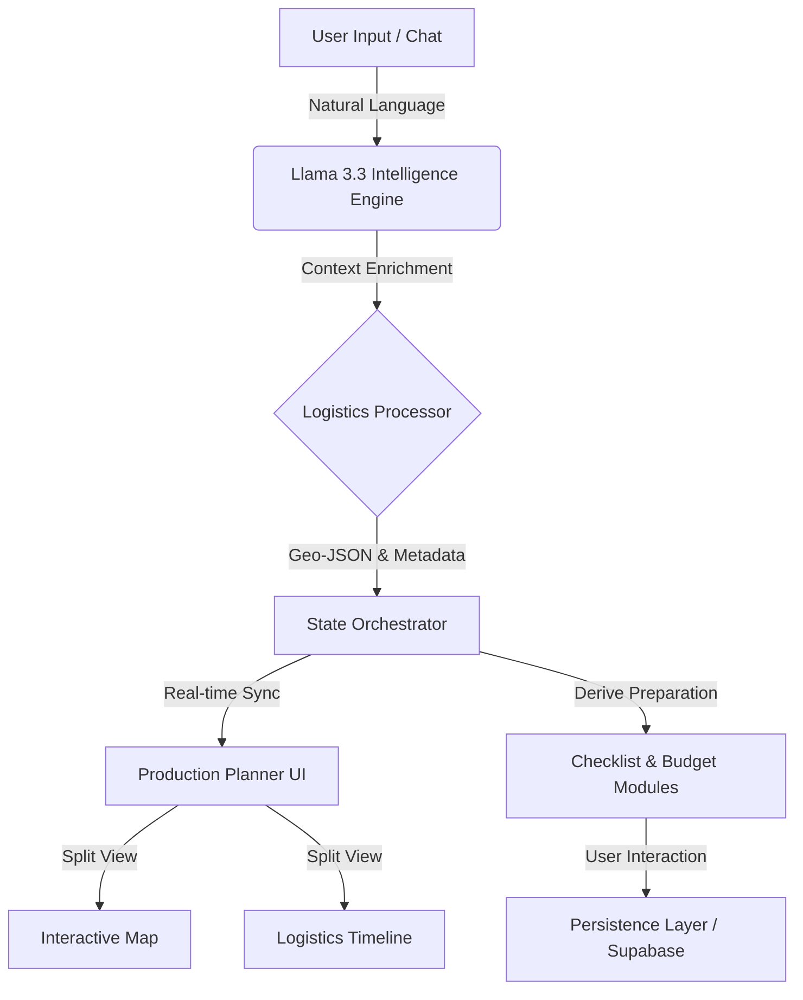

# 🌟 Traveloop: Agentic Journey Engineering System

[](https://nextjs.org/)
[](https://reactjs.org/)
[](https://groq.com/)
[](https://leafletjs.com/)

> **"Traditional planners give you lists. Traveloop gives you a produced experience."**

Traveloop is a high-performance, AI-native travel orchestration platform. It is designed to bridge the gap between "simple suggestions" and "production-ready logistics." By leveraging a custom agentic flow, Traveloop architects complex, spatially-aware itineraries that prioritize traveler flow, geographic efficiency, and narrative depth.

---

## 🚀 The Complete Feature Suite

Traveloop is a comprehensive ecosystem that handles every phase of a journey, from conception to preparation.

### 🧠 1. AI Orchestration & Intelligence (The Intelligence Lab)
Traveloop's central nervous system, powered by the **Llama-3.3-70B-Versatile** model, provides a suite of tools designed for maximum impact:
*   **Agentic Chat Architect (`INSANE`):** A context-aware conversational interface that tracks chat history to refine journey drafts iteratively.
*   **Spatial Logistics Processor (`OSRM-Like Logic`):** Geographic distance-based sequencing that minimizes zigzagging and travel fatigue.
*   **Crowd Optimization Patterns:** Intelligent scheduling that predicts and avoids peak crowd hours at major tourist hotspots.
*   **Temporal Awareness Engine:** Built-in awareness of real-world opening hours and seasonality to prevent scheduling conflicts.
*   **Meal Timing Intelligence:** Automatically integrates optimized slots for Breakfast, Lunch, and Dinner based on the day's activity density.
*   **Cinematic Storytelling:** AI-synthesized narrative overviews that provide emotional and cultural context to your logistics.
*   **Intelligent Suggestions (`HUGE IMPACT`):** Proactive AI advice on hidden gems, photography vantage points, and local cultural etiquette.
*   **"Why This Order?" Logic:** Integrated reasoning tooltips explaining the logistical optimization (distance, hours, crowd) behind every choice.

### ⚡ 2. The Production Workspace (Split-View)
The core engine where journeys are refined and visualized in real-time:
*   **Logistics Timeline (`VERY HIGH`):** A professional-grade chronological schedule with built-in **"Travel Gap"** detection.
*   **Interactive Spatial Map (`HIGH`):** Numbered itinerary stops with synchronized route visualization and real-time spatial highlights.
*   **Dynamic ID Mapping:** Clicking a timeline card instantly centers the map and highlights the corresponding spatial coordinate.
*   **Deep-Dive Detail Drawer:** Instant access to activity-specific metrics, including travel time, distance, cost, and AI optimization notes.
*   **Interactive Day Navigation:** Collapsible day-headers with location-aware metadata and city summaries.

### 🏢 3. The Dashboard Hub (AI Feature Suite)
A premium control center organizing all preparation modules into a cohesive SaaS interface:
*   **Intelligence Hub (`WOW-READY`):** A premium grid view showcasing the full suite of project capabilities with real-time impact labels.
*   **Smart Trip Checklist (`EASY WOW`):** Category-based (Documents, Tech, Health, Gear) readiness tracker with real-time progress visualization.
*   **Budget Optimizer (`HIGH`):** Dynamic cost tracking and allocation charts showing spend across Flights, Stay, and Dining.
*   **AI Smart Packing List:** Tailored gear recommendations automatically generated based on climate and planned activities.
*   **Expense Transaction Feed:** A clean record of all travel-related financial investments.

*   **Spatial Intelligence Engine:** Map bounds automatically calculate the optimal zoom and center to encompass all daily activities.
*   **Dynamic Polyline Routing:** Visualizes the agentic path between locations with real-time distance calculations.
### 🛡️ 3.1 Executive Admin Dashboard (Control Center)

A centralized command hub enabling administrators to monitor, manage, and optimize the entire Traveloop ecosystem in real time.

*   **Executive Overview Panel:** A premium analytics dashboard providing a high-level operational snapshot of platform activity.
*   **Global User Monitoring:** Track total registered users and monitor platform adoption trends with live user metrics.
*   **Itinerary Management (`HIGH CONTROL`):** View, monitor, and manage all generated travel itineraries across the platform.
*   **Recent Itinerary Tracking:** Access recently created trips with metadata including trip title, user ID, budget allocation, and creation timestamp.
*   **User Administration:** Monitor platform users, analyze engagement, and manage user-related operations securely.
*   **Security Management (`ADMIN READY`):** Dedicated administrative controls for authentication monitoring and platform security operations.
*   **System Health Monitoring:** Real-time infrastructure diagnostics for:
    *   **Database Connectivity:** Monitor Supabase connection health and operational status.
    *   **AI Engine Status:** Track Groq/Llama model availability and performance readiness.
    *   **Authentication Services:** Ensure secure login systems remain operational.
*   **Live Activity Awareness:** Monitor currently active users and platform engagement in real time.
*   **Budget Intelligence Metrics:** Analyze average trip budgets to understand traveler spending behavior and planning preferences.
*   **Admin Insight Layer:** AI-assisted operational suggestions to help administrators identify platform trends and optimize system performance.
*   **Role-Based Access Control (`RBAC`):** Secure admin-only access to sensitive dashboards and platform management capabilities.

#### 🔍 Admin Capabilities
Administrators can efficiently manage:

✅ **Users** — Monitor user activity, engagement, and platform usage.  
✅ **Itineraries** — Track and oversee all generated travel plans.  
✅ **System Health** — Verify backend services and AI systems are operational.  
✅ **Security** — Monitor authentication and protected platform workflows.  
✅ **Analytics** — Observe platform growth, budget trends, and live activity.

> **Traveloop Admin Dashboard is designed as a mission-control layer for operational intelligence, platform stability, and seamless ecosystem management.**
### 🎨 4. Design & Engineering Excellence
*   **"Golden Hour" Design System:** A meticulously curated CSS variable-based token system (Cream, Peach, Coral, Navy) for visual consistency.
*   **Framer Motion Micro-Interactions:** Physics-based animations, layout transitions, and interactive hover effects.
*   **Raw Leaflet Integration:** A custom-engineered map wrapper that ensures stability and high performance on React 18, bypassing heavy DOM reconciliations.
*   **Optimistic UI Updates:** Instant checkbox and state transitions for the Checklist and Budget modules.

---

## 🏗️ System Architecture

Traveloop follows a modular, decoupled architecture designed for scale and high interactivity.



### 🗺️ Technical Infrastructure Blueprint

The following blueprint outlines the current and planned infrastructure for the Traveloop ecosystem:

```text
┌─────────────────────────────────────────────────────────────────────┐
│                        PRESENTATION LAYER                           │
│  Next.js 14 + Tailwind CSS  │  Served via Vercel CDN (Global)      │
│  Leaflet.js (maps)  │  Lucide Icons  │  Framer Motion (UX)          │
└────────────────────────────┬────────────────────────────────────────┘
                             │ HTTPS REST + JSON / WebSockets
                             ▼
┌─────────────────────────────────────────────────────────────────────┐
│                       APPLICATION LAYER                             │
│  Next.js API Routes (Serverless) / Node.js Runtime                 │
│  JWT Middleware  │  Auth Guard  │  Rate Limiting  │  CORS Policy     │
│  ┌──────────┐  ┌──────────┐  ┌──────────┐  ┌──────────────────┐  │
│  │  Auth    │  │  Trips   │  │   AI     │  │   Location/Util  │  │
│  │ Service  │  │ Service  │  │ Service  │  │     Services     │  │
│  └──────────┘  └──────────┘  └──────────┘  └──────────────────┘  │
│                        Persistence Logic                            │
└───────────┬──────────────────────────────────┬───────────────────-─┘
            │                                  │
            ▼                                  ▼
┌─────────────────────────────────────────────────────────────────────┐
│   DATA LAYER        │          │   EXTERNAL FREE SERVICES     │
│  Supabase           │          │  Google Gemini Flash (AI)    │
│  (PostgreSQL)       │          │  Cloudinary Free (media)     │
│  Row Level Security │          │  OpenStreetMap (maps)        │
│  Real-time Sync     │          │  Resend.com (email)          │
└─────────────────────┘          └──────────────────────────────┘
```

---


## 💎 Why Traveloop? (Competitive Edge)

1.  **Solving Logistics Blindness:** While others ignore transit time, Traveloop calculates it. We detect the "Travel Gaps" and help you fill them.
2.  **Spatial Clarity:** 1-to-1 synchronization between the list and the map ensures you never get lost in your own itinerary.
3.  **Human-in-the-Loop Intelligence:** We don't just tell you *what* to do; our "AI Reasons" explain *why* it's the best choice for you.

---

## ⚡ Engineering Deep-Dive

*   **State Orchestration:** Centralized memoized data flow ensures that complex itineraries with hundreds of nodes re-render smoothly.
*   **Hydration-Safe Mapping:** Using `next/dynamic` for client-only Leaflet initialization, preventing SSR "Window is not defined" errors.
*   **Atomic Component Design:** Highly reusable UI modules following a strict design token system for visual consistency.

---

## 🛠️ Project Structure

```bash
├── app/
│   ├── api/ai/           # The Intelligence Engine (Llama 3.3)
│   ├── components/       # Premium UI System (Map, Timeline, Production Lab)
│   ├── dashboard/        # Intelligence Lab, Budget, Checklist, Planner Hub
│   ├── globals.css       # The "Golden Hour" Design Tokens
│   └── layout.jsx        # App-wide Shell & Typography
├── hooks/                # Data Orchestration & Trip Persistence
├── lib/                  # Shared Utils & Logic
└── public/               # Asset Repository
```

---

## 🏁 Installation

1. `npm install`
2. Configure `.env.local` with `GROQ_API_KEY`.
3. `npm run dev`

---

**Built with ❤️ for the world's most ambitious travelers.**
*Transforming data into discovery.*
